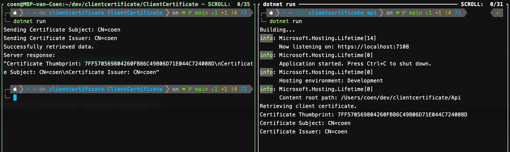

# Sending and receiving messages with client certificates

This sample demonstrates how to send and receive messages with client certificates. The sample uses a self-signed certificate for testing purposes.

*The API contains additional code to accept self-signed certificates. This of course is cannot be used for production.*

Running the API and afterwards the ClientCertificate project will send a request to the API. The result will be displayed in the console, like so:


## Create the certificate 
The following steps will guide you through creating a self-signed certificate for testing purposes.
All files that are created in this section are located in the root directory of the project.

### Generate a Private Key:

``` bash
openssl genpkey -algorithm RSA -out client.key -pkeyopt rsa_keygen_bits:2048
```
### Create a Certificate Signing Request (CSR):

``` bash
openssl req -new -key client.key -out client.csr -subj "/CN=coen"
```
Replace /CN=coen with your desired Common Name.

### Generate a Self-Signed Certificate:

``` bash
openssl x509 -req -days 365 -in client.csr -signkey client.key -out client.crt
```
### Create a .pfx File:

``` bash
openssl pkcs12 -export -out client.pfx -inkey client.key -in client.crt -passout pass:coen
```

Replace coen with your desired password.